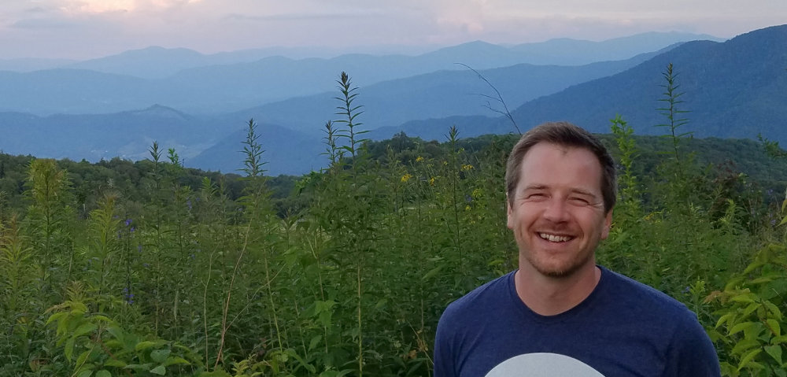

## About

I'm a postdoc working under an NSF Postdoctoral Fellowship in the Imaging, Robotics, and Intelligent Systems (IRIS) Lab at the University of Tennessee. My interests lie at the intersection of organismal biology and machine learning, and specifically in applications like automatically identifying species and automatically describing biological specimens. I have a background in entomology (with dragonflies and weevils) and evolutionary biology. This site outlines my postdoc and dissertation research, as well as a few side projects. Please have a look around and contact me if you have questions, have suggestions, or are interested in learning more about my work.

### Contact

**Dept. Electrical Engineering & Computer Science** 
University of Tennessee

**Ming Kao Engineering Building** 
Room 236 
1520 Middle Drive 
Knoxville, Tennessee 37996

**willkuhn [at] crossveins [dot] com**

### [Curriculum vitae (PDF)](assets/docs/Kuhn CV.pdf)

***

## Research

### Targeted Odonata Wing Digitization Project

<!--  -->

The TOWD Project is a collaborative effort with Rutgers and University of Alabama, and several other institutions to digitize the wings of all North American species of dragonflies and damselflies, and to build a publicly-available image library, hosted by [CyVerse](https://cyverse.org/) Cyberinfrastructure. We're incorporating wing-based species identification engine, which will be trained to distinguish all North American Odonata, and creating tools to be able to automatically extract phenological information from these images (such as wing shape, size, color, and patterning) for comparative analysis. This work if funded by an NSF ABI [grant](#grants). ([project website](https://willkuhn.github.io/towd/))

### Photo-based species identification of dragonflies & damselflies

<!--  -->

This, my current project, extends my dissertation work to build a more practical tool for automatically identifying dragonfly and damselfly species from real-world images. I plan to train and test the systyem for identifying user images in OdonataCentral, but it should be general enough that it could be applied toward other groups of organisms as well. This ID tool will help researchers to identify their specimens in the field, and help citizen scientists and curious enthusiasts to find out what kind of insects are living in their own backyard! I am currently working on this project with Dr. Mongi Abidi in the[ IRIS Lab](http://imaging.utk.edu/) at University of Tennessee as part of an [NSF-funded postdoc](#grants).

### Wing-based species identification of dragonflies & damselflies

<!--  -->

For this, the main focus of my dissertation work, I built a software system (in Python) for automatically identifying dragonflies and damselflies (Odonata). Unlike my current work (above), this system used only images of the insects' wings, simplifying image processing. This worked utilized a feature extraction method that I developed (below) to pull informative information from wing images, in order to classify individuals to species. The system is able to classify odonate species with up to a 92% accuracy (for comparison, experts are 85-94% accurate at distinguishing species). The project is in collaboration with [Gareth Russell](https://sites.google.com/a/njit.edu/russell-lab/) and [Jessica Ware](https://www.jessicalwarelab.com/), and we plan to incorporate this and my other tools into a web-based identification tool for Odonata and an identification engine that could be applied other groups of insects that are harder to classify (e.g., flies or wasps).

### Zen of Dragons image-annotation project on Zooniverse

<!--  -->

[Zen of Dragons](https://www.zooniverse.org/projects/willkuhn/zen-of-dragons) is my project on the crowd-sourcing site Zooniverse.org, where citizen scientists can help annotate images of dragonflies and damselflies. These data will be used to train a detection and localization model for spotting Odonata in photographs. This model is the first step in my automatic species identification system (below): once we're able to locate these insects in photos, we can classify them to species.

### wingrid: a Python package for comparing wings based on color

<!--  -->

[wingrid](https://github.com/willkuhn/wingrid) is a small Python package for quantifying and comparing "appearance" of insect wings, particularly Lepidoptera (butterflies and moths) and Odonata (dragonflies and damselflies). A deformable grid is fitted to images of wings, allowing local color values to then be consistently sampled from them. The package includes tools for analyzing and visualizing features extracted from a set of wings.

### Color, texture & shape-based feature extraction from wings

Images of biological specimens contain myriad information that is informative for taxonomy, systematics, and evolutionary biology.  For this project (part of my dissertation), I focused on wings of dragonflies and damselflies, but my methods are general enough to that they might be applied to other insects as well.  I developed a procedure for standardizing digital scans of wings, so that they can more easily be compared with one another, and for pulling out useful information related to wing color and patterning, using a novel analysis of image chromaticity and Gabor wavelet transformation, respectively.  In this process, an image is encoded into a vector of descriptive coefficients, which can be used for comparative analyses more effectively than comparing images, pixel-by-pixel.  These methods were developed as part of the Polythore damselfly project below, and the automated species ID from wings project described above.

### Landmarking wings automatically for shape analysis

Landmarking—the placement of points on homologous, biologically-meaningful locations on 2D or 3D specimen images—is a useful and common practice in the field of geometric morphometrics, the quantitative analysis of shape.  For most applications, landmarks are placed by hand using software, such as [tpsDig2](http://life.bio.sunysb.edu/morph/soft-dataacq.html).  This is a tedious, time-consuming, and subjective process requiring lots of pointing and clicking.  I’m working on software that borrows algorithms from face recognition and medical imaging applications in order to place landmarks automatically on images.  The idea is that the software first learns the configuration and appearance of landmarks from training examples -- essentially building a model to represent those landmarks -- and can then be applied to predict the locations of those landmarks on novel images.  My goal is to develop this automatic landmarking software as a stand-alone tool, as well as a module that could be incorporated into the automatic identification system from wings, above.

### Color polymorphism & mimicry in *Polythore* damselflies

Species in the damselfly genus *Polythore* have highly polymorphic wing patterns, both within species and between species.  In [this paper](http://journals.plos.org/plosone/article?id=10.1371/journal.pone.0125074), I developed a method for extracting novel morphological characters, which are based on wing color and patterning, and co-developed (with M. Sánchez Herrera) a protocol for landmarking *Polythore* wings, which captured wing shape and banding pattern.  We compared phylogenetic reconstructions for *Polythore* based on these morphological data and molecular data.  We found incongruences between the two, which suggest both that both polymorphic species and cryptic species exist within this clade.

***

## Publications

{:.pubs-list}
| 2018 | Kohli, MK, G Sahlén, **WR Kuhn**, E Pilgrim, JL Ware. In review. Extremely low genetic diversity in the circumpolar dragonfly species, *Somatochlora sahlbergi* (Insecta: Odonata: Anisoptera). Scientific Reports. |
| 2016 | **Kuhn, WR**. 2016. Three Approaches to Automating Taxonomy with Emphasis on the Odonata (Dragonflies and Damselflies). PhD Dissertation. Federated Dept. of Biological Sciences, Rutgers University, Newark, NJ. 189 pp. |
| 2015 | Sanchez-Herrera, M, **WR Kuhn**, MO Lorenzo-Carballa, KM Harding, N Ankrom, TN Sherratt, J Hoffman, H Van Gossum, JL Ware, A Cordero-Rivera, CD Beatty. 2015. Mixed signals? Morphological and molecular evidence suggest a color polymorphism in the Neotropical *Polythore* damselflies. PLOS One 10(4): e0125074. [[link](http://dx.doi.org/10.1371/journal.pone.0125074)] [[pdf](assets/docs/Sanchez_et_al_2015_Polythore.pdf)] [[supp files & Mathematica notebook](https://www.dropbox.com/s/d0xtzgil41b8wn7/Supplementary%20file%20S1.zip?dl=0)*] |
| 2013 | **Kuhn, WR**, RR Youngman, K Love, T Mize, S Wu, and CA Laub. 2013. Billbugs (Coleoptera: Curculionidae) new to orchardgrass (*Dactylis glomerata*) grown in Virginia. Entomolological News 123(4): 315–316. [[link](http://dx.doi.org/10.3157/021.123.0405)] [[pdf](assets/docs/Kuhn_et_al_2013_Ent_News.pdf)] |
|  | **Kuhn, WR**, RR Youngman, S Wu, and CA Laub. 2013. Ecology, taxonomy, and pest management of billbugs (Coleoptera: Curculionidae) in orchardgrass of Virginia. Journal of Integrated Pest Management 4(3): B1–B5. [[link](http://dx.doi.org/10.1603/IPM12022)] [[pdf](assets/docs/Kuhn_et_al_2013_JIPM.pdf)] |
|  | **Kuhn, WR**, and JL Ware. 2013. A review of “Dragonflies and Damselflies of the East (Princeton Field Guides)” by Dennis Paulson. Entomologica Americana 119(1 & 2): 46. [[link](http://dx.doi.org/10.1664/12-BR-008.1)] |
| 2012 | Biazzo, I, GR Bourne, D Evangelista, J Evangelista, V Funk, M Sanchez-Herrera, C Kelloff, MK Kohli, W Kuhn, N Sroczynski, and J Ware. 2012. Guyana days: Collecting in the northern Guyana Shield. Argia 24: 12–14. [[pdf](assets/docs/Biazzo_et_al_2012_Argia.pdf)] |
| 2010 | **Kuhn, WR**. 2010. Pest management of billbugs in orchardgrass grown in Virginia. Master's Thesis. Department of Entomology, Virginia Tech, Blacksburg. 81 pp. [[pdf](assets/docs/Kuhn_2010_MS_thesis.pdf)] |
|  | **Kuhn, WR**, RR Youngman, CA Laub, KP Love, and TA Mize. 2010. Bluegrass billbug pest management in orchardgrass. Virginia Cooperative Extension pub. 444-440. [[link](http://pubs.ext.vt.edu/444/444-040/444-040.html)] [[pdf](assets/docs/Kuhn_et_al_2010_Bluegrass_Billbug.pdf)] |
|  | **Kuhn, WR**, RR Youngman, CA Laub, KP Love, and TA Mize. 2010. Hunting billbug pest management in orchardgrass. Virginia Cooperative Extension pub. 444-041. [[link](http://pubs.ext.vt.edu/444/444-041/444-041.html)] [[pdf](assets/docs/Kuhn_et_al_2010_Hunting_Billbug.pdf)] |

\*Note: Scripts in the Sanchez-Herrera et al. 2015 supplementary files require Wolfram [Mathematica](https://www.wolfram.com/mathematica/) (and optionally [Past](http://folk.uio.no/ohammer/past/)) to run.

***

## Grants

{:.pubs-list}
| 2016 | Leveraging face-detection methods to identify insects from field photos, automatically (**PI**, [link](http://www.nsf.gov/awardsearch/showAward?AWD_ID=1611642)) | $138,000 |
|  | ODOMATIC: Automatic Species Identification, Functional Morphology, and Feature Extraction to alleviate the taxonomic impediment and broaden citizen science tools (**senior personnel**, [link](http://www.nsf.gov/awardsearch/showAward?AWD_ID=1564386)) | $432,015 |

***

## Links

- [Discover Life in America](https://dlia.org/)
- [Worldwide Dragonfly Association](https://worlddragonfly.org)
- [IRIS Lab at University of Tennessee](http://imaging.utk.edu/)
- [Insect Systematics Lab at Rutgers University-Newark](https://www.jessicalwarelab.com/)
- [Odonata Central](http://www.odonatacentral.org/)
- [Some keys to Odonata in or near Guyana](https://www.dropbox.com/sh/ky70r1nes4pollw/AAA67JnMW6Q187RaBkkNP4Aga?dl=0)
